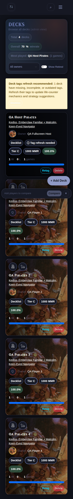

# Deck tile owner avatars

Verified and deployed to Test on 2026-09-29. Every deck tile uses the shared
profile-picture macro beside its owner's name, with a 40px picture or initials
fallback. The image is decorative because the visible name supplies its label.
At mobile widths, badges wrap below the title and owner row so names remain
readable. The Decks stylesheet URL is versioned for existing cached clients.

Chromium checks used the isolated synthetic QA app at localhost:5062. At 1440px,
390px, and 320px, every tile had exactly one 40px avatar; photos loaded, initials
rendered, names fit, and clicking an avatar opened the deck with working back
navigation. No JavaScript errors occurred. All 24 existing deck-navigation and
profile-picture regression tests passed in a disposable container with its own DB.

Test's deployed template and CSS match the verified files and health returns 200.

[Desktop screenshot](deck-owner-avatars-1440.png)

