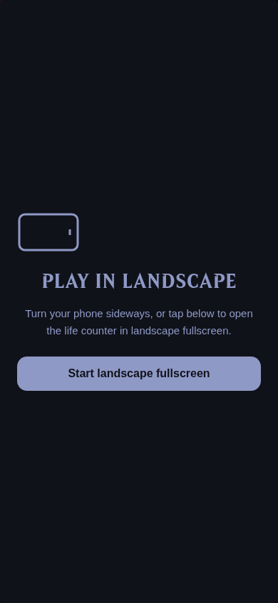
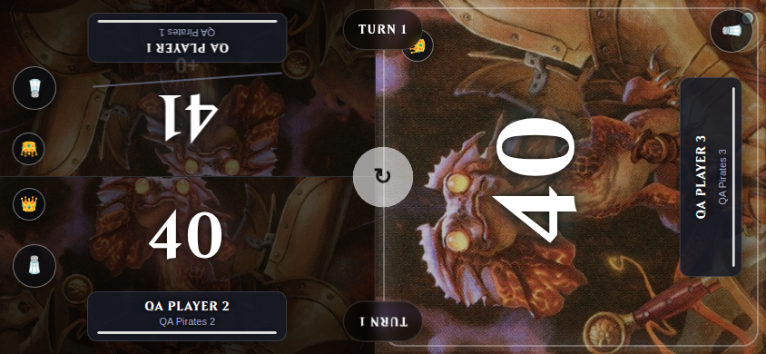
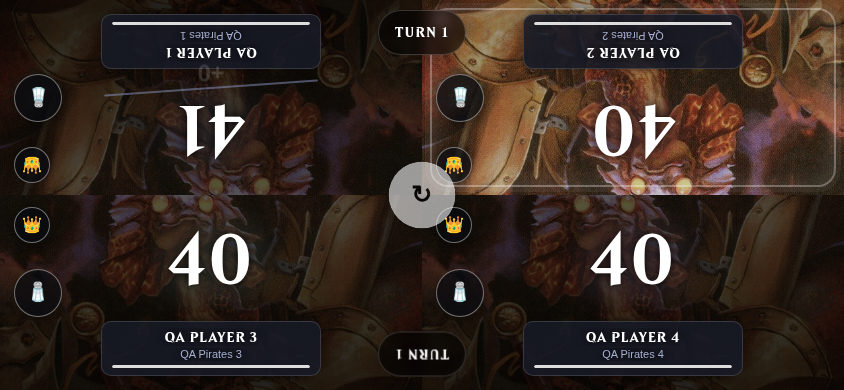

# Landscape fullscreen — deployed test-site verification

Date: 2026-09-21
Test site: https://cmtg.figurensohn.de
Deployed image: `sha256:ac64087e409064a0fed9bdd4853ae50847366af22540a888cf8a0ff2a79fdc92`

## Behavior

An upright touch device now gets a **Start landscape fullscreen** entry screen. The button requests fullscreen from the tap, then requests landscape once fullscreen is active. The entry screen disappears when the viewport becomes landscape. While it is shown, the board is inert and game timers are paused. If orientation locking is rejected, the screen explicitly asks the player to rotate their phone and enable Auto-rotate if necessary.

The game menu supports fullscreen entry/exit in landscape. The shared manifest allows rotation, and versioned manifest, script and stylesheet URLs prevent the previous cached versions being used for this release. The main site was not redeployed.

## Verification

- The Docker test service was rebuilt from `/home/slemme/mine/commander-tracker-test` after copying the five changed frontend files into that checkout. Existing backend and deck-editor files matched their deployed versions before the rebuild.
- Confirmed all five deployed frontend files match the reviewed source. `/healthz` and the new fullscreen script return HTTP 200 on localhost:5001. The public HTTPS test URL serves the exact updated script and manifest.
- Through the deployed UI, created four clearly marked QA players, each with a saved 100-card deck imported from `https://archidekt.com/decks/10697552/pirates_unmodified`. Existing user records were preserved.
- Through the public test URL, created running three- and four-player games from `/play_game`. Chromium mobile/touch emulation verified the portrait entry screen, inert board, fullscreen-before-landscape request ordering, visible rotation fallback, landscape card/content bounds, life changes, turn passing, and fullscreen exit. No JavaScript page errors occurred.
- Existing life-counter and game-state tests: **11 passed**, using a separate temporary database. Both checkout diffs passed whitespace checks.

The browser test records actual fullscreen transitions and orientation API calls, then resizes to landscape for visual verification. It does not establish physical Android Opera rotation behavior; no physical Opera device was available. Earlier local-only checks were not deployment verification and should not be treated as such.

## Screenshots from the public test site

