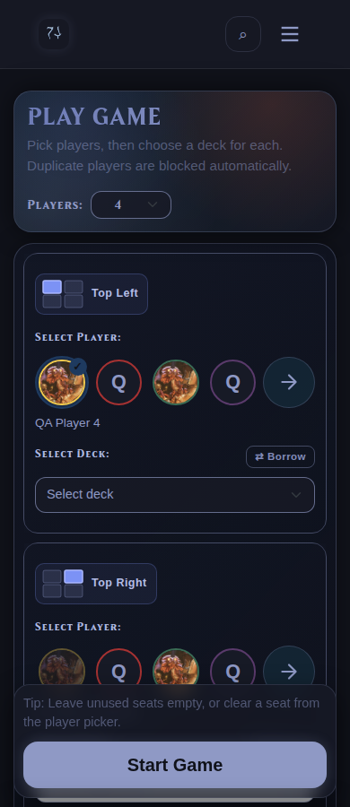
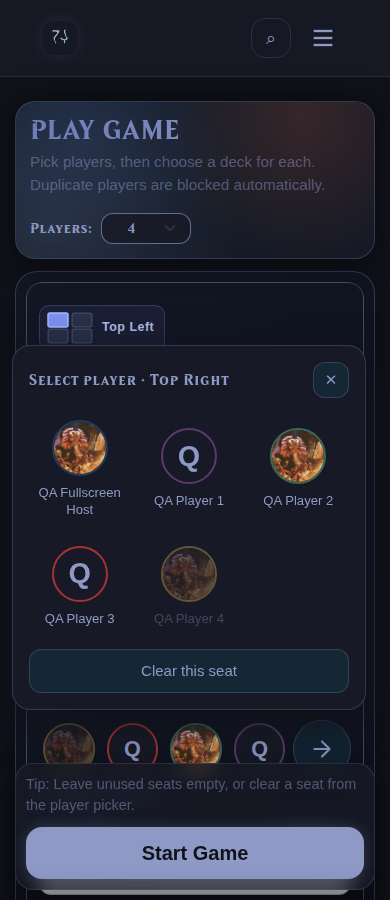
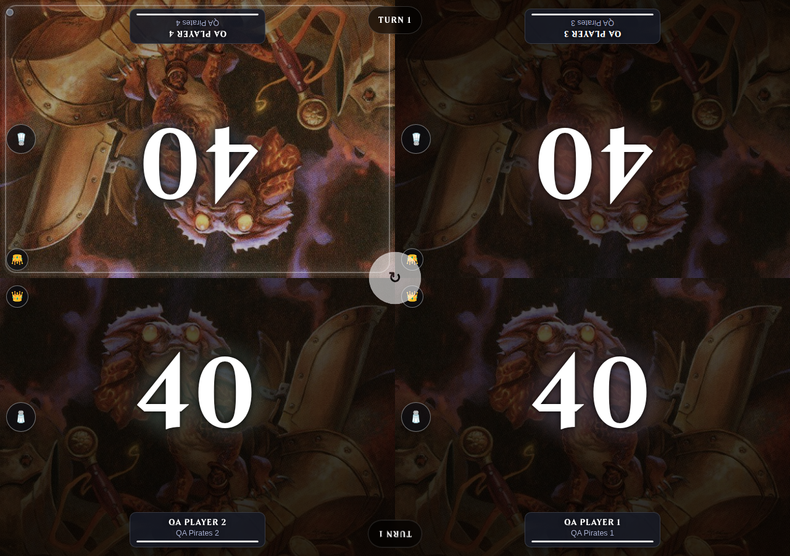

# Avatar player picker

Verified on 2026-09-29 and deployed to Test (port 5001).

The game setup uses four avatar shortcuts per seat, ordered by each player's most
recent recorded game in the active pod (alphabetical ties and fallback). The full
picker remains alphabetical. A themed arrow opens
an anchored native dialog with every available player's avatar and name. A chosen
player remains visible in the shortcut row. Players assigned to another active
seat are disabled. The dialog supports clearing the seat, Escape, outside-click
closing, and focus restoration. Existing player select values drive deck choices,
borrowing, starting-player choices, and form submission. Browsers without native
dialog support retain the original select controls.

Browser verification ran against the Test source on `0.0.0.0:5062`, reached by
Chromium at `http://localhost:5062`. The isolated database copied the existing
synthetic QA fixture, containing four QA players with saved real decklists; the QA
host also received a copy of a saved list. Production and Test records were not
modified by these browser checks.

Checks passed for:

- Quick selection and choosing a player outside the initial four.
- Duplicate blocking and releasing a player after a seat is cleared or removed.
- Deck reset and Borrow exit when the player changes.
- Rematch prefilled selection and reducing player count.
- Two through six seats at 1280px, 1024px, 390px, and 320px widths.
- Popup viewport bounds, Escape/focus restoration, and outside-click closing.
- Starting a four-player game with distinct players/decks and all life totals at 40.
- No JavaScript page errors.

The pre-existing desktop navbar extends past the viewport at 1280px; overflow
checks here apply to the game setup and avatar controls. The picker itself fits
all tested widths, including 44px shortcut targets at 320px.

All **35 regression tests** passed across recent-player ordering, pod isolation,
no-history fallback, rematch prefill, game state,
life history, and Android parity, using a disposable container and temporary DB.
Test's deployed CSS, JS, and template exactly match the verified files; `/healthz`
returns HTTP 200. CSS and JS URLs are versioned for cached clients.

[Desktop player grid](player-picker-1280.png)

