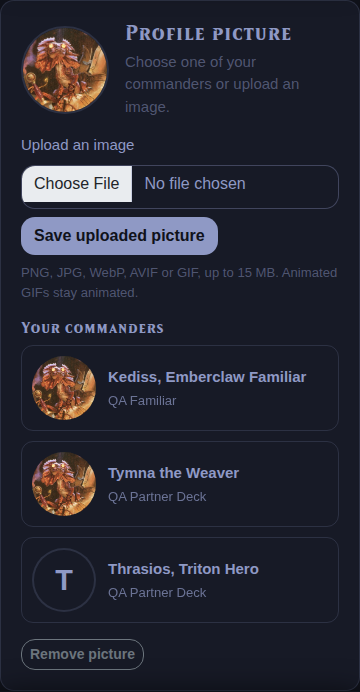

# Player profile pictures

Verified on 2026-09-28 using an isolated SQLite database and art directory under
`/tmp/commander-picture-qa`, with Flask bound to `0.0.0.0:5059`. Chromium reached
the app at `http://localhost:5059`.

## Automated checks

58 tests passed across `test_player_profile_picture.py`, `test_entity_api.py`,
`test_api_account_export.py`, `test_api_decks_write.py`, and `test_user_identity.py`.
Coverage includes:

- Own and partner commander choices, unavailable art, and cross-player rejection.
- Owner/admin authorization and web CSRF protection.
- Animated GIF bytes and MIME type preserved through local and object storage.
- Invalid/oversized uploads, replacement/removal, and failed-commit cleanup.
- Shared commander images retained while referenced by a player or deck.
- Account anonymization and guest deletion removing profile uploads.
- Existing-player schema upgrade and repeat migration execution.

## Browser checks

Desktop (1280 × 960) and mobile (390 × 844) checks passed for commander selection,
upload preview, saving, reloading, removal, player cards, player profiles, and
the player detail drawer. Two successive screenshots of an uploaded GIF differed,
confirming visible animation; the served bytes also matched the two-frame source.
The mobile layout had no horizontal overflow and retained an 88 × 88 circular
preview. No JavaScript errors occurred.

[Desktop account page](player-profile-picture-desktop.png)

## Deployment

SQLite applies the additive `028_player_profile_picture` migration on startup.
For an existing PostgreSQL installation, apply
[`028_player_profile_picture.sql`](../migrations/028_player_profile_picture.sql)
before starting the updated app. Fresh installations include the nullable column.
PostgreSQL execution was not tested locally.
