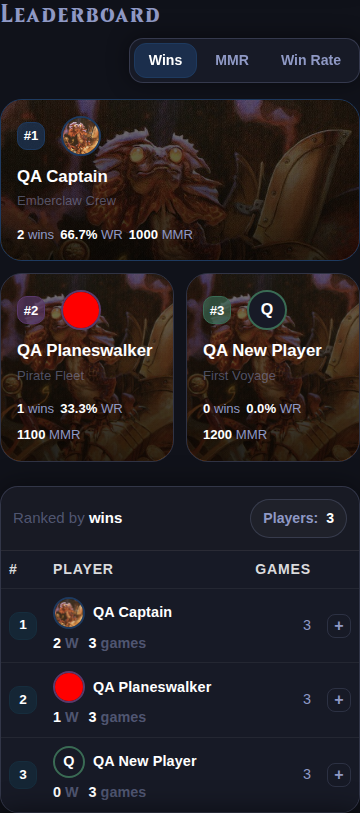

# Profile picture placements

Verified on 2026-09-28 with three isolated QA players: one commander picture,
one animated GIF, and one initials fallback.

Pictures now appear in the Home-page roster, leaderboard podium and table,
deck owners, recent-game winners and participants, and expanded game details.
They also appear in player comparisons, Saltmine player rankings, recorded-game
lists and participant cards, player search results, and game/player drawers.

The shared avatar component supports compact sizes, player accent borders, and
decorative image labels when the player's name is already visible beside it.
Leaderboard sorting retains the correct player/picture pairing. GIFs are rendered
as ordinary images to preserve animation.

## Verification

- 92 tests passed across profile pictures, entity APIs, Home dashboard, search,
  comparison, game crosslinks, and game narrative suites.
- Chromium checks passed at desktop width and at 390px and 320px mobile widths.
- Verified picture/fallback counts, sort identity, visible GIF animation, search,
  drawers, comparisons, Saltmine, and recorded-game participant cards.
- No JavaScript errors or page-level horizontal overflow in the checked views.
- Corrected mobile leaderboard spacing and narrow comparison wrapping found in
  visual review.
- Local server bound to `0.0.0.0:5063`, reachable at `http://localhost:5063`.
  The initial port 5060 was blocked by Chromium (`ERR_UNSAFE_PORT`); switching
  to 5063 resolved the connection before screenshots were captured.

[Desktop leaderboard](profile-pictures-leaderboard-desktop.png) ·
[Recent game details](profile-pictures-recent-game.png)
